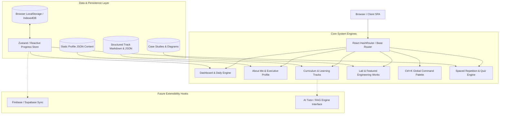

# System Architecture — Sambit's AI Engineering Academy & Learning OS

## 1. High-Level Architecture Overview

AgenticHub is structured as a client-side, offline-capable SPA (Single Page Application) architected around the **Three-Identity Paradigm**:

---

## 2. Core Architectural Principles

1. **Decoupled Data Architecture**: All profile facts, curriculum lessons, coding problems, and case studies are declared as structured TypeScript/JSON data objects rather than hardcoded inside JSX templates.
2. **Offline-First & Zero-Backend**: Runs 100% on static hosting (GitHub Pages) with local state synchronization.
3. **Pluggable AI Interface (`AIProvider`)**: Allows plugging in OpenAI, Anthropic, Google Gemini, Ollama, or LangGraph endpoints in future iterations without refactoring UI layers.
4. **Deterministic Daily Engine**: Computes personalized daily study plans based on completion state, difficulty, confidence ratings, and review intervals.

---

## 3. Technology Stack Specification

- **UI Framework**: React 18 with TypeScript 5.7+
- **Bundler & Dev Server**: Vite 6
- **Routing**: React Router 6 (`HashRouter` for zero-configuration GitHub Pages subpath routing)
- **Design System & Styling**: Tailwind CSS 3.4 with custom Linear/Vercel dark tokens
- **Icons**: Lucide React
- **Syntax Highlighting & Formatting**: JetBrains Mono code view with instant copy
- **Animations & Micro-interactions**: Tailwind transitions + Canvas Confetti for milestones
