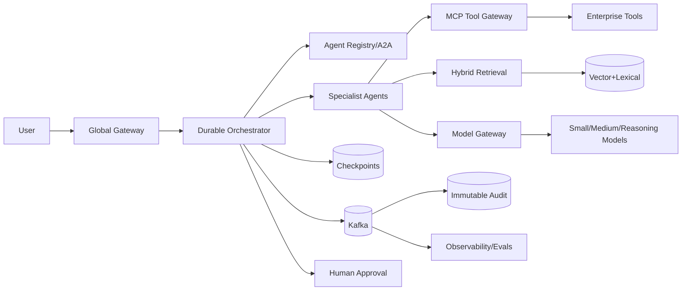

# Production Multi-Agent AI Platform (MCP + A2A)
**Date:** 2026-09-27 | **Level:** Staff / Principal

## Market relevance
2026 agent architecture is moving toward interoperable, governed systems. MCP covers agent-to-tool/data access; A2A covers delegation between independently operated agents. This design combines distributed systems, AI inference, security, data, workflow durability, observability and economics. All numbers below are interview assumptions.

## Problem and domains
Build a platform that accepts complex objectives, durably plans work, delegates to specialist agents, retrieves governed knowledge, invokes enterprise tools, pauses for human approval, and produces an auditable result.

Domains: API/Admission; Durable Orchestrator; Agent Registry/A2A; MCP Tool Gateway; Retrieval; Model Gateway; Policy/Safety; Audit/Evaluation. Boundaries follow ownership, invariants and failure isolation.

## Requirements
Functional: idempotent task submission; versioned agent discovery/delegation; governed MCP tool calls; hybrid RAG; durable checkpoints/resume; progress/cancel; human approval; provenance/replay; tenant budgets.

NFR: 99.99% API availability; gateway p99 <150ms excluding model/tool; orchestration p99 <100ms; retrieval p95 <250ms; first progress <1s; task-state RPO <=1 min; regional RTO <=15 min; provider failover <=5 min; no acknowledged audit loss; strict tenant isolation.

## Capacity math
Assume 1M DAU × 5 tasks/day = **5M tasks/day**. Average = 57.9 submits/s; 12× peak = **~695/s**. At 8 steps/task = 40M steps/day and **~5,560 peak steps/s**. At 2.5 tools/step = 100M/day and **~13,900 peak tool calls/s**. At 1.2 model calls/step = 48M/day and **~6,670 peak model calls/s**. Two retrievals/step = 80M/day and **~11,100 peak retrievals/s**.

Naive tokens: 48M × 3,100 = **148.8B/day**. Route 65% small@900, 25% medium@2,500, 10% reasoning@6,000 => 28.08B+30B+28.8B = **86.88B/day**, ~42% fewer tokens before price differences.

State: 40M steps × 12KB = **480GB/day raw**; RF3 = **1.44TB/day**; 30-day hot = **43.2TB** before compression. Tier completed traces to object storage.

Events: 6/step = 240M/day = 2,778/s average; 12× peak = **33.3k/s**. At 2KB/event = **66.6MB/s** before replication. Assuming 5MB/s safe ingress/partition gives 14 minimum; provision **48 Kafka partitions** for headroom/parallelism. RF3 implies ~200MB/s replicated peak ingress.

Cache: 2M hot registry/tool/policy objects × 8KB = 16GB raw; budget **32GB Redis** with overhead.

Vectors: 500M × 1,536 × 2 bytes = **1.536TB raw**; 2.2× index/metadata × RF2 ≈ **6.76TB physical**.

## API/idempotency
POST /v1/tasks uses Idempotency-Key plus tenant, objective, deadline, risk and max cost. Store (tenant,key)->request_hash,task_id,expiry. Same hash returns original; changed payload returns 409. Cancellation and approval are durable versioned transitions.

For side effects: operation_id=hash(task_id,step_id,semantic_action). MCP gateway records the outcome; retry returns prior result rather than executing twice.

## Architecture

## Durable state and data
State: SUBMITTED→PLANNING→RUNNING→WAITING_INPUT/APPROVAL→COMPLETED|FAILED|CANCELED|REJECTED. Workers are disposable. Use compare-and-swap task_version plus fencing token for ownership. Never hold a distributed lock across an LLM call.

Core records: tasks, steps, idempotency, agents, approvals, tool_operations. SQL for policy/approval/registry/idempotency; scalable KV/distributed SQL for task checkpoints depending transaction needs; object storage for traces; Kafka for events; Redis for ephemeral cache; dedicated vector/search engine for retrieval.

Partition task/steps by hash(tenant_id,task_id), isolate whale tenants, index tenant+created_at and tenant+status+updated_at. Reject “one DB for everything”: retention and query patterns differ.

## MCP, A2A, RAG, models
MCP gateway: allowlist/version pinning, scoped identity exchange, schema validation, DLP, policy, idempotency, timeout/concurrency/circuit breakers, response redaction and audit. Secrets never enter model context.

A2A: use at independently operated agent boundaries, not between every function. Pin selected agent version in trace. Delegation carries tenant, capability, deadline, budget and trace context with least privilege.

RAG: ingest→scan→normalize→chunk→ACL metadata→embedding→vector+lexical. Query→rewrite→ACL prefilter→ANN+BM25→fusion→rerank→context compression. Similarity is never authorization.

Model routing: small for classify/extract/repair; medium for routine synthesis; reasoning model for ambiguous/high-risk planning; rules/code for deterministic work. Validate structured outputs. Cache only safe results keyed by tenant/model/prompt/tool versions.

## Consistency and multi-region
Task ownership, approvals and irreversible-action idempotency prefer consistency; progress and analytics can be eventually consistent. PACELC: global synchronous writes add latency even without partition, so assign a home region and use stronger global semantics only for invariants that require them.

Active-active admission across three regions; one home region executes a task. Lease+fencing prevents split brain. On loss, recovery acquires a higher epoch, resumes last committed checkpoint and replays only idempotent operations. Keep residency-bound data/model/tool traffic regional.

## Reliability and overload
Global routing→regional L7→mesh→workers. Least-request handles variable agent duration. Queues decouple admission.

Retries: exponential backoff+jitter only for retryable 429/selected 5xx/network errors. Do not retry policy rejection, invalid input or uncertain non-idempotent effects. Circuit-break by provider/tool/region.

Backpressure: hash task IDs; split whale tenants; cap fan-out; weighted fair queues; adaptive model/tool concurrency; autoscale on queue age; shed low-priority work before checkpoint storage saturates.

Rate limits: tenant RPS, concurrent tasks, model tokens/min, tool calls/min and spend/day.

## Failure/DR
Worker death→lease expiry/resume checkpoint. Model outage→breaker/fallback. Tool timeout→safe retry or reconcile. Kafka lag→scale consumers without corrupting task state. Checkpoint DB outage→stop side effects; never continue only in memory. Vector loss→replica/lexical fallback. Duplicate event→dedupe. Region partition→fencing failover. Poison tool response→validate/quarantine. Approval timeout→fail/compensate.

Task-state RPO <=1m, RTO <=15m. Sensitive accepted audit targets RPO 0. Run monthly restore and quarterly region-evacuation tests.

## Observability/evaluation/security
Track golden signals plus task success, steps/task, fan-out, tool denial/timeout, tokens/task, cost/task, retrieval quality, groundedness, fallback rate, policy blocks, approval wait, checkpoint latency, queue age and trace completeness. Trace request→task→plan→agent→retrieval/model/tool with all component versions.

Evaluation: golden sets for task success, constraints, grounding, tool correctness, policy, latency and cost. Shadow model/prompt changes. LLM-as-judge must be calibrated against humans and versioned.

Threats: prompt injection, tool poisoning, confused deputy, cross-tenant leakage, excessive agency, SSRF, malicious tool servers, unsafe delegation, replay and audit tampering. Controls: workload identity, short-lived scoped access, mTLS, capability allowlists, egress controls, sandboxing, schema validation, DLP, encryption, immutable audit and HITL for high-risk writes.

## Evolution/cost/scaling
Version APIs, Agent Cards and event schemas. Make events additively backward compatible; consumers upgrade first.

Cost drivers: inference, rerank, vector memory, traces, egress, SaaS tools. Optimize in order: remove calls→route smaller models→compress context→safe cache→batch→cold tier→regional locality→hard task budgets.

Scale path: <20 QPS single region; 20-1k add durable workflow/Kafka/gateways; 1k-10k add multi-region/fencing/isolation; >10k step QPS use **cell architecture** so each cell owns bounded tenants, queues, caches, orchestrators and task shards.

## Trade-offs
1. Bounded workflow vs autonomy: autonomy only where uncertainty creates value.
2. Direct MCP vs gateway: gateway costs a hop but centralizes security/idempotency/audit.
3. A2A everywhere vs boundaries: avoid unnecessary protocol/network complexity.
4. Global consistency vs home-region ownership: fencing avoids global lock per step.
5. One frontier model vs routing: routing reduces cost and provider blast radius.
6. Vector-only vs hybrid: exact IDs need lexical; semantics need vectors.
7. Checkpoint every step vs selective: recoverability vs write amplification.
8. Fail-open vs fail-closed: high-risk writes fail closed.

## Capacity/bottlenecks/testing/rollout
At 5,560 peak steps/s and 60% target utilization, provision **9,267 steps/s**. If an I/O worker holds 20 concurrent steps averaging 4s, throughput≈5 steps/s, requiring ~1,854 worker equivalents before failover reserve. Watch model quota, retrieval p95, checkpoint commit latency, Kafka lag, tool queue age and shard skew.

Test state machines, protocol contracts, deterministic fake models/tools, idempotency properties, peak fan-out, chaos, prompt/SSRF attacks, replay without side effects, golden-set regression and DR restore.

Roll out read-only→shadow→low-risk tools→approval-gated writes→tenant canary. Pin and roll back prompt/model/agent/tool/policy versions independently.

## Staff vs Principal
Staff: APIs, stores, queues, retries, idempotency, RAG/model choices, calculations, failures.
Principal: trust/ownership boundaries, limits on autonomy, cell/multi-region strategy, economics, governance/migration, consistency by invariant, blast radius and cross-team platform contracts.

## 20 interview Q&A
1. One giant agent? Poor isolation, privilege, context and evaluation.
2. MCP vs A2A? Tools/data vs independent-agent delegation.
3. Authoritative state? Durable orchestrator/store.
4. Duplicate effects? Idempotency+operation ledger.
5. Worker death? Lease/fencing+checkpoint resume.
6. Retry all errors? No; classify retryability/effect safety.
7. Cost control? Fewer calls, routing, compression, caching, budgets.
8. Secure tools? Scoped identity, policy gateway, validation, audit.
9. RAG isolation? Authorization filter; similarity never grants access.
10. Model outage? Provider breaker+approved fallback.
11. Strong consistency? Approval/idempotency/ownership/irreversible actions.
12. Eventual consistency? Analytics/progress/health caches.
13. Why Kafka? Replayable decoupling, not authoritative workflow state.
14. Partition key? hash(tenant,task), whale isolation.
15. Agent eval? Outcome+tool correctness+grounding+policy+latency+cost.
16. Debug bad result? Reconstruct versioned end-to-end trace.
17. HITL? Irreversible, regulated, high-value or low-confidence action.
18. Cells? Bound blast radius and scale independently.
19. Hidden bottleneck? Model/tool quotas and checkpoint amplification.
20. Interview priority? Invariants, math, state, failure, security, trade-offs—not framework trivia.

## Principal checklist
- [ ] invariants/risk tier; domain/trust boundaries; QPS/storage/token/cost math
- [ ] submission+side-effect idempotency; durable state/replay; fencing
- [ ] least-privilege MCP; justified A2A; RAG authorization
- [ ] routing/fallback/budgets; consistency by invariant; backpressure
- [ ] RPO/RTO restore tests; quality+cost observability; threat model
- [ ] compatible versioning; rejected alternatives; canary/rollback
- [ ] bounded blast radius; every action attributable to actor/evidence/version
